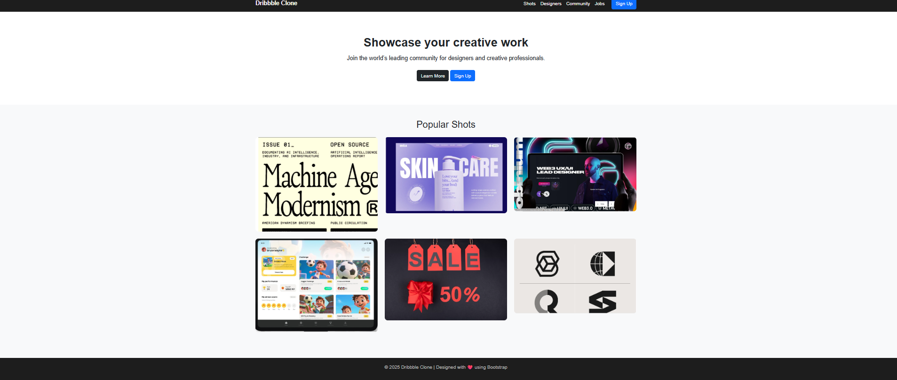

# Project Responsive Web Design using Bootstrap
# Date:15/10/2025
# AIM:
To create a simplified clone of Dribbble (https://dribbble.com/) landing page.

# DESIGN STEPS:
## Step 1:
Clone the repository from GitHub.

## Step 2:
Create Django Admin project.

## Step 3:
Create a New App under the Django Admin project.

## Step 4:
Insert the necessary CSS and JavaScript files as external in order to use Bootstrap.

## Step 5:
Create a HTML file and include the needed Bootstrap components.

## Step 6:
Publish the website in the LocalHost.

# PROGRAM :
```
<!DOCTYPE html>
<html lang="en">
<head>
  <meta charset="UTF-8">
  <meta name="viewport" content="width=device-width, initial-scale=1.0">
  <title>Dribbble Clone</title>
  <!-- Bootstrap CSS -->
  <link href="https://cdn.jsdelivr.net/npm/bootstrap@5.3.3/dist/css/bootstrap.min.css" rel="stylesheet">

  <style>
    body {
      font-family: 'Poppins', sans-serif;
      background-color: #f8f9fa;
    }
    .navbar {
      background-color: #1d1d1d;
    }
    .navbar-brand, .nav-link {
      color: #fff !important;
    }
    .hero {
      text-align: center;
      padding: 80px 20px;
      background-color: #fff;
    }
    .hero h1 {
      font-size: 2.5rem;
      font-weight: 700;
    }
    .gallery img {
      width: 100%;
      border-radius: 10px;
      transition: transform 0.3s;
    }
    .gallery img:hover {
      transform: scale(1.05);
    }
    footer {
      background-color: #1d1d1d;
      color: #bbb;
      text-align: center;
      padding: 20px 0;
      margin-top: 40px;
    }
  </style>
</head>
<body>

  <!-- Navbar -->
  <nav class="navbar navbar-expand-lg navbar-dark">
    <div class="container">
      <a class="navbar-brand fw-bold" href="#">Dribbble Clone</a>
      <button class="navbar-toggler" type="button" data-bs-toggle="collapse" data-bs-target="#navbarNav">
        <span class="navbar-toggler-icon"></span>
      </button>

      <div class="collapse navbar-collapse" id="navbarNav">
        <ul class="navbar-nav ms-auto">
          <li class="nav-item"><a class="nav-link" href="#">Shots</a></li>
          <li class="nav-item"><a class="nav-link" href="#">Designers</a></li>
          <li class="nav-item"><a class="nav-link" href="#">Community</a></li>
          <li class="nav-item"><a class="nav-link" href="#">Jobs</a></li>
          <li class="nav-item"><a class="btn btn-primary ms-3" href="#">Sign Up</a></li>
        </ul>
      </div>
    </div>
  </nav>

  <!-- Hero Section -->
  <section class="hero">
    <div class="container">
      <h1 class="mb-3">Showcase your creative work</h1>
      <p class="lead mb-4">Join the world’s leading community for designers and creative professionals.</p>
      <a href="#" class="btn btn-dark">Learn More</a>
      <a href="#" class="btn btn-primary">Sign Up</a>
    </div>
  </section>

  <!-- Gallery Section -->
  <section class="gallery py-5">
    <div class="container">
      <h2 class="text-center mb-4">Popular Shots</h2>
      <div class="row g-4">
        <div class="col-md-4 col-sm-6">
          
        </div>
        <div class="col-md-4 col-sm-6">
          
        </div>
        <div class="col-md-4 col-sm-6">
          
        </div>
        <div class="col-md-4 col-sm-6">
          
        </div>
        <div class="col-md-4 col-sm-6">
          
        </div>
        <div class="col-md-4 col-sm-6">
          
        </div>
      </div>
    </div>
  </section>

  <!-- Footer -->
  <footer>
    <p>© 2025 Dribbble Clone | Designed with ❤ using Bootstrap</p>
  </footer>

  <!-- Bootstrap JS -->
  <script src="https://cdn.jsdelivr.net/npm/bootstrap@5.3.3/dist/js/bootstrap.bundle.min.js"></script>
</body>
```
# OUTPUT:

# RESULT:
The Project for responsive web design using Bootstrap is completed successfully.
